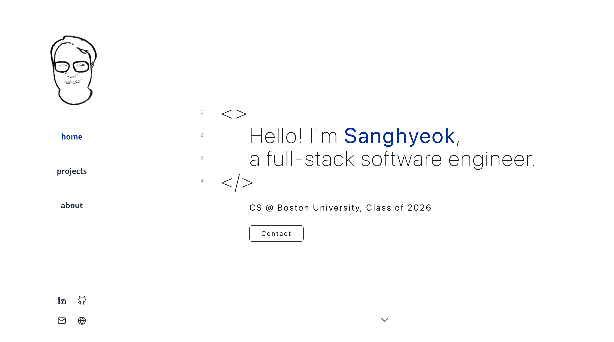

 

  

  <h1 align="center">kangsk.dev</h1>

  

    A personal developer portfolio built to showcase my various projects, built using TypeScript, React.js, Next.js, and hosted on Vercel.
     
  

    

## Demo

    

## License

kangsk.dev is licensed under the [MIT License](https://opensource.org/licenses/MIT).

## Contact

For inquiries or suggestions, contact the developer at sanghyeok@kangsk.dev.